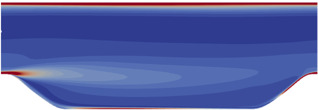
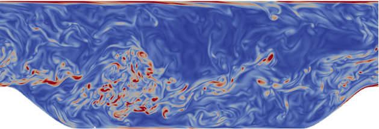
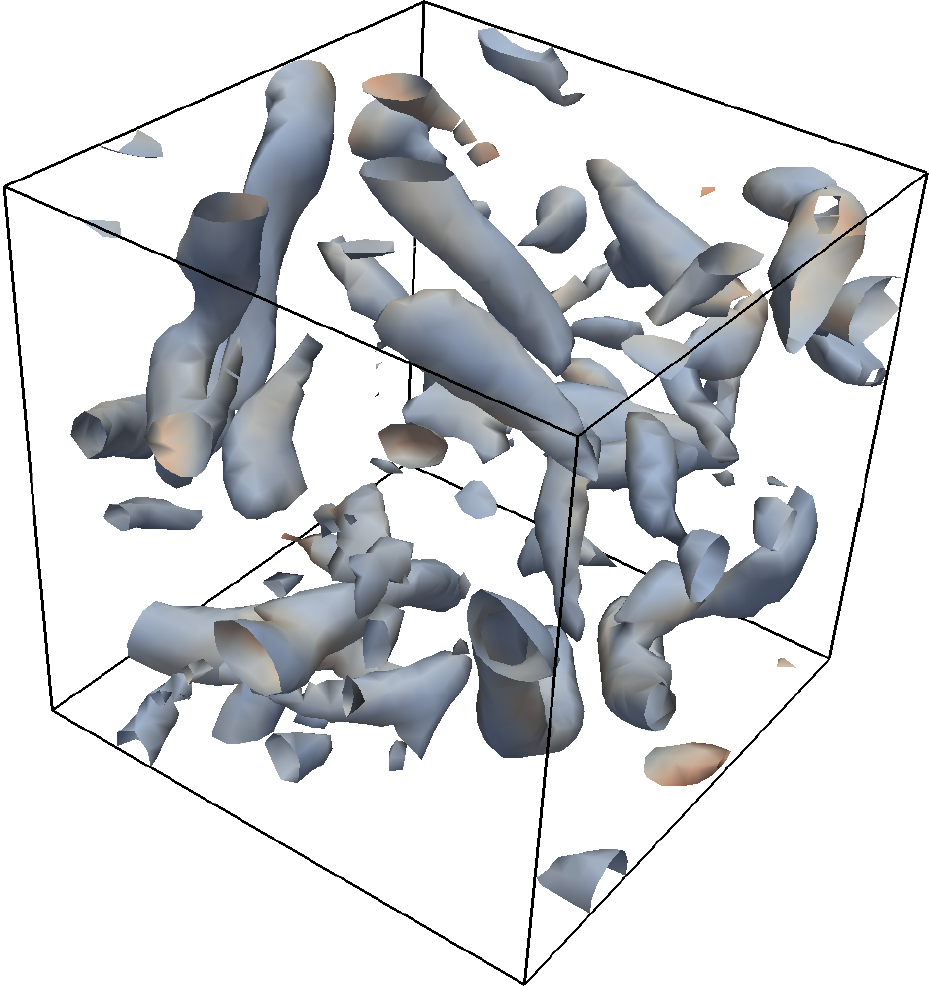
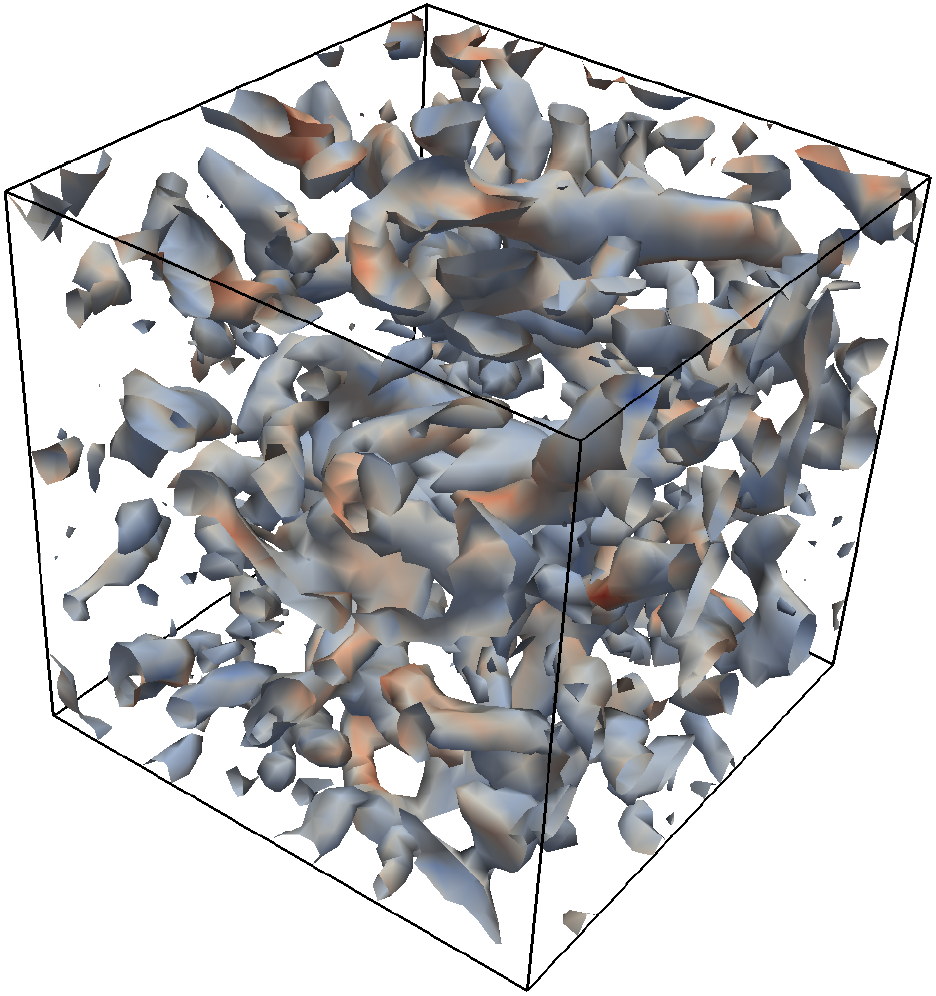

## Introduction
Computational fluid dynamics (CFD) simulations play an important role in the design of modern aircraft. They are used to predict the flow around and through an aircraft, ultimately helping engineers design more efficient aircraft. The turbulence models used in such simulations are typically calibrated on relatively simple flows, and struggle to correctly account for the complex flow physics occuring in aeronautical applications.

{% include figure.html
            image_path="assets/images/posts/comp_les/aircraft_cfd.jpg"
            alt="aircraft_cfd"
            width = "50%"
            caption="Figure 1: A CFD simulation of an aircraft.  Source: DLR, CC-BY 3.0."%}

A potentially more accurate family of methods are eddy resolving simulations, where 
turbulent structures are *simulated* (instead of *modelled*). Such approaches are significantly more expensive computationally, but are becoming more achievable due to ever increasing advances in computing power. A compromise between the two families of approaches is *Large Eddy Simulation* (LES). Here, the large energy containing turbulent structures, which are difficult to model, are simulated. Whereas the smallest structures, which are expensive to simulate yet easy to model, are modelled.
  
<figure>
    

        

            <figure>

                <figcaption>
a) Modelled
</figcaption>
            </figure>
        

        

            <figure>

                <figcaption>
b) Simulated
</figcaption>
            </figure>
        

    

    <figcaption>
Figure 2: CFD simulations of a periodic hill, with turbulence either modelled or simulated. 
</figcaption>
</figure>

My PhD [project](https://www.repository.cam.ac.uk/handle/1810/270030) involved working with [Rolls-Royce](https://www.rolls-royce.com/products-and-services/civil-aerospace.aspx) to examine the feasibility of modifying an industrial CFD code, in order to run high fidelity Large Eddy Simulation of flows typical of those seen in aero-engine compressors. The project, supervised by [Prof. Paul Tucker](https://www.murrayedwards.cam.ac.uk/fellows/professor-paul-g-tucker) at the University of Cambridge, was broadly split into three parts. These are described in more detail in the following three sections.

{% include figure.html
            image_path="assets/images/posts/comp_les/trent_xwb.png"
            alt="trent_xwb"
            width = "45%"
            caption="Figure 3: A modern gas-turbine aero-engine, the Trent XWB."%}

## Part 1: Modifying an industrial CFD code

Aerospace companies have years, if not decades, of knowledge and experience embedded within their CFD codes. Therefore, it is desirable for companies to be able to extend their existing codes for CFD methods such as LES. This is challenging, since codes developed with turbulence modelling in mind are usually quite numerically dissiptive. This aids convergence to steady-state solutions, but in an LES context it has the undesirable effect of draining energy from the turbulent structures.   

<figure>
    

        

            <figure>

                <figcaption>
a) High smoothing
</figcaption>
            </figure>
        

        

            <figure>

                <figcaption>
b) Low smoothing
</figcaption>
            </figure>
        

    

    <figcaption>
Figure 4: LES of forced isotropic turbulence, with two different levels of numerical smoothing. 
</figcaption>
</figure>

To avoid excessive numerical dissipation, one option is to lower the amount of smoothing, as is done for the canonical test case above. But, lower it too much and the opposite problem occurs, with excessive numerical dispersion (oscillations) occuring in the flow. Alternatively, one can increase the order of the spatial discretisations. However, this increases the communication required between computational grid points, which is undesirable for a code which must be parallelised across 1000's of processor cores. To tackle this issue, we instead implemented a novel adaptive smoothing scheme. This adjusts the smoothing locally, so that *just enough* smoothing is used to prevent spurious oscillations. This enabled a mature industrial CFD code to accurately run large LES simulations, with minimal tuning required.

## Part 2: Laminar to turbulence transition

A particular challenge for CFD computations of aero-engine compressors is laminar to turbulent transition. An example of this is given below, where the laminar boundary layer on the suction surface of a compressor blade is transitioning to turbulence via the classical *bypass transition* mode. Transition models struggle to correctly account for the complex transition mechanisms present in turbo-machinery flows, leading to poor performance predictions.

{% include figure.html
            image_path="assets/images/posts/comp_les/compressor_transition.png"
            alt="suction_transition"
            width = "80%"
            caption="Figure 5: LES of a compressor blade. Laminar to turbulent transition is occuring on the suction surface, and a Λ-vortex typically associated with the bypass transition mode is highlighted."%}

In this part of the project, we explored whether LES computations performed with the upgraded CFD solver were better able to predict laminar to turbulent transition over a compressor blade. The numerical smoothing was found to be crucial, with the novel adaptive smoothing scheme yielding more reliable predictions. 

Aditionally, the Sub-Grid Scale (SGS) model, which models the small (unresolved) turbulent eddies, was found to be important. It was necessary to implement more advanced SGS models in the code, which correctly *switch off* in laminar regions of the flow. With the adaptive smoothing scheme and advanced SGS models, LES computations were demonstrated to be able to accurately capture the transition mechanisms occuring on both sides of the compressor blade.

## Part 3: Towards real compressor flows

After verifying the capability to reliably run accurate LES computations in parts 1 and 2, the final part of the project involved looking towards more realistic compressor flows. LES was used to explore two important flow features observed in real compressors.

### (i) Wake induced transition

The first flow feature examined was wake induced transition. This involves wakes from upstream blade rows destabilising the laminar boundary layer, causing it to transition to turbulence. The unsteady nature of this phenomenon makes it difficult to account for using turbulence and transition models. Whereas with LES, we were able to closely examine the influence of the wakes, as seen in the below animation.

{% include figure.html
            image_path="assets/images/posts/suction.gif"
            alt="wake_transition"
            width = "60%"
            caption="Figure 6: LES of wake induced laminar to turbulent transitition over a compressor blade."%}

The wakes were found to have a significant impact on the transition processes over the blade, and therefore the loss mechanisms over the blade. This highlights the importance of considering upstream wakes when designing aero-engine compressors, and also demonstrated how LES could be a valuable tool here.

### (ii) 3D corner separations

The figure below shows some of the various *secondary flows* which occur in a real compressor. These can have a significant effect on the performance of the compressor. A major secondary flow is the three-dimensional separation which occurs in the corner where the blade connects to the hub (or casing). Turbulence models often dramatically over-predict the size of this separation, leading to under-estimates of the compressor's efficiency. 

{% include figure.html
            image_path="assets/images/posts/comp_les/secondary_flows.jpg"
            alt="secondary_flows_compressor"
            width = "40%"
            caption="Figure 7: Secondary flows seen in a compressor."%}

To examine some of the challenges for turbulence models in this region we ran numerous LES computations of the blade-hub corner region, with one of the simulations shown in the figure below. The flow in the corner region was found to be highly complex, with highly anisotropic turbulence and large scale aperiodic unsteadiness. Additionally, the LES indicated that it is important to accurately capture the suction surface transition location, with early transition leading to a larger endwall separation. This has important implicications for engineers looking to model such flows, since it implies that in addition to the turbulence model, the addition of a suitable transition model is also important. 

{% include figure.html
            image_path="assets/images/posts/comp_les/compressor_endwall.png"
            alt="compressor_endwall"
            width = "50%"
            caption="Figure 8: LES of a compressor endwall flow."%}

## Conclusions

This work demonstrated that a mature industrial CFD code, designed for low fidelity modelled flows, can be successfully modified to run *predictive* high fidelity Large Eddy Simulations. The word *predictive* is important here. This means that the LES can be viewed as a *numerical experiment*. It can be run with minimal tuning, and we can trust the results it gives. For most applications the computational cost of LES is still prohibitively high for it to be used in everyday design calculations. However, this work demonstrates how LES provide important physical insights into a flow. Such insights could be invaluable in designing the next generation of turbulence and transition models. Finally, predictive LES could also be used in a multi-fidelity setting, with the trusted LES predictions being used to guide cheaper but less accurate lower fidelity computations. 

## Relevent publications

Scillitoe, A., Tucker, P. G., & Adami, P. (2015). *Evaluation of RANS and ZDES Methods for the Prediction of Three-Dimensional Separation in Axial Flow Compressors*. In Proc. of ASME Turbo Expo 2015 (pp. 1–15). Montreal, Canada. DOI: [10.1115/GT2015-43975](https://doi.org/10.1115/GT2015-43975). [PDF](../assets/papers/scillitoe-asme-2015.pdf).

Scillitoe, A., Tucker, P. G., & Adami, P. (2017). *Numerical Investigation of Three-Dimensional Separation in an Axial Flow Compressor: The Influence of Freestream Turbulence Intensity and Endwall Boundary Layer State*. Journal of Turbomachinery, 139(2), 021011 1-10. DOI: [10.1115/1.4034797](https://doi.org/10.1115/1.4034797). [PDF](../assets/papers/scillitoe-turbo-2017.pdf).

Scillitoe, A., Tucker, P. G., & Adami, P. (2019). *Large Eddy Simulation of Boundary Layer Transition Mechanisms in a Gas-Turbine Compressor Cascade*. Journal of Turbomachinery, 141(1), 1–10. DOI: [10.1115/1.4042023](https://doi.org/10.1115/1.4042023). [PDF](../assets/papers/scillitoe-turbo-2019.pdf).

Scillitoe, A. (2017). *Towards Predictive Eddy Resolving Simulations for Gas Turbine Compressors*. PhD Thesis, University of Cambridge. DOI: [10.17863/CAM.16871](https://doi.org/10.17863/CAM.16871). [PDF](../assets/papers/scillitoe_thesis.pdf).
